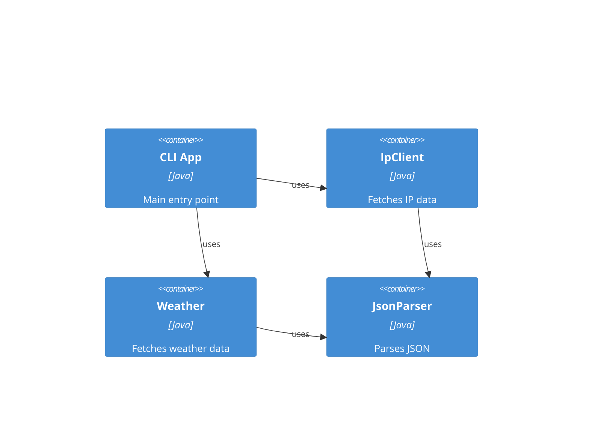

# Structure for inetum_copilot-java

## Overview

A Java CLI application that fetches user's IP location and weather information using public APIs.

## Bill of Materials

- **Language**: Java 17
- **Framework**: None
- **Database**: None
- **State Management**: None
- **Styling**: N/A
- **Testing**: JUnit 5
- **Build Tools**: Maven

### Development / Deployment workflow

Develop using Maven for building and testing. Compile with `mvn compile`, run tests with `mvn test`, package with `mvn package`, and run the JAR with `java -jar target/ask-bot-0.1.0-SNAPSHOT.jar`.

## Folder Structure

```
inetum_copilot-java/
├── LICENSE
├── pom.xml
├── README.md
├── docs/
│   ├── activity-bookings.en.PRD.md
│   ├── activity-bookings.PRD.md
│   ├── ask-bot.en.PRD.md
│   ├── ask-bot.PRD.md
│   ├── alumnos.txt
│   ├── specs/
│   │   └── 1-weather.spec.md
│   └── (other files)
├── src/
│   ├── main/
│   │   └── java/
│   │       └── com/
│   │           └── inetum/
│   │               └── askbot/
│   │                   ├── IpApiResponse.java
│   │                   ├── IpClient.java
│   │                   ├── JsonParser.java
│   │                   ├── Main.java
│   │                   └── Weather.java
│   └── test/
│       └── java/
│           └── com/
│               └── inetum/
│                   └── askbot/
│                       └── JsonParserTest.java
└── target/
    ├── classes/
    ├── generated-sources/
    ├── generated-test-sources/
    ├── maven-status/
    ├── surefire-reports/
    └── test-classes/
```

### Key files

- **`pom.xml`**: Maven project configuration specifying Java 17, JUnit 5 dependencies, and build plugins.
- **`src/main/java/com/inetum/askbot/Main.java`**: Main class that handles CLI arguments and orchestrates IP and weather fetching.
- **`src/main/java/com/inetum/askbot/IpClient.java`**: Utility class for fetching and parsing IP geolocation data from ipapi.co.
- **`src/main/java/com/inetum/askbot/Weather.java`**: Utility class for fetching and displaying weather information from open-meteo.com.
- **`src/main/java/com/inetum/askbot/JsonParser.java`**: Custom JSON parser implementation for handling API responses.
- **`src/main/java/com/inetum/askbot/IpApiResponse.java`**: Immutable record representing the structure of IP API responses.

## Components diagram



> End of STRUCTURE for inetum_copilot-java, last updated on October 3, 2025.